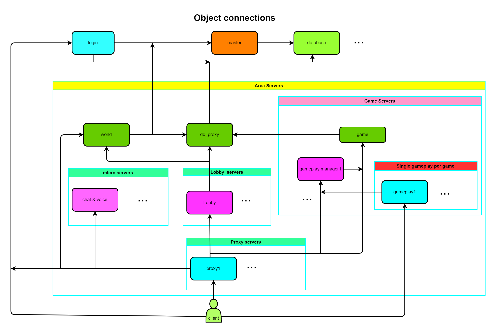
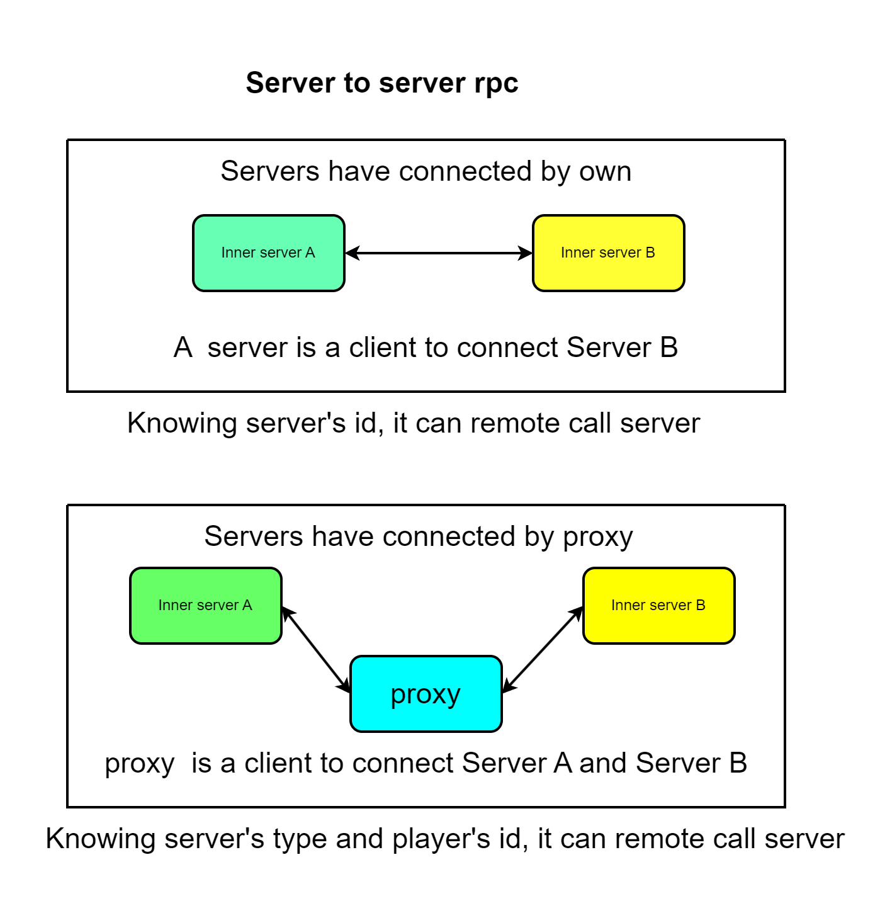

# Squick

近年来,随着互联网飞速发展,元宇宙引发了全球科技产业的高度关注和投资热潮,在这个元宇宙技术的领域里,服务端技术的高低决定了元宇宙发展的成熟度,一个高度可扩展、高性能、高可用的服务端框架用以支持元宇宙应用程序的开发和部署是本次研究的方向。pwnsky团队提出了一种面向元宇宙的分布式服务器框架设计与实现方法,为构建高性能、可扩展的元宇宙系统提供了理论基础和技术支持。通过对需求和特点进行了深入分析,本文明确了分布式服务端框架的设计目标和相关技术。用 C++和 Lua 语言共同编写此框架,将框架拆分成了内核层、节点层和业务层,提升程序的拓展性和可维护性。将业务功能拆分到不同节点上运行,以实现不同功能的解耦和资源的高效利用,利用动态负载均衡算法,可以在不同节点之间有效地分配任务,确保系统的稳定性和性能。最后,采用科学的方式对框架进行测试且给相应的实验数据,并将该框架运用在某商业项目中,也对所做的内容进行了总结和展望。

**Unity SDK**:  [squick-unity-sdk](https://github.com/pwnsky/squick-unity-sdk)

**Unreal SDK**: [squick-unreal-sdk](https://github.com/pwnsky/squick-unreal-sdk)

**后台**:  [squick-mid](https://github.com/pwnsky/squick-mid)

**讨论QQ群：739065686**

**version:** 1.0.2

---


[](https://github.com/pwnsky/Squick)
[](https://github.com/pwnsky/Squick)
[](https://opensource.org/licenses/Apache-2.0)


## 项目例子

[生化密码](https://github.com/pwnsky/BiochemicalSecrets)


## 设计目标

1. K8s集群【10%】
2. 同区节点所有节点负载状态自同步【80%】
3. 提供稳定服务、保证服务的高可用 【10%】
4. 优化超低的CPU、内存、网络的占用【20%】
5. 拥有规范的测试，能够让开发人员自测各种性能指标（CPU、内存、网络）【10%】
6. 插件模块组合,让开发功能变成开发拓展的插件模块 【100%】
7. 解耦框架代码与业务项目代码【60%】
8. 日志系统,能够将日志异步写入到文件里,且在 Linux 环境下程序崩溃时,自动 Dump Stack 调用链写入崩溃文件 【100%】
9. 分布式服务,各服务之间通过网络来进行沟通,可通过分布式+集群方式减轻服务器压力 【50%】
10. 支持业务代码的热更新 【50%】
11. 支持跨平台,可以在 Windows、Linux 上编译和开发,在 Windows 上可以支持 VS 进行项目开发【100%】
12. 支持 1 变 N 或 N 变 1,一个物理机上单个进程启动全部服务器,方便开发调试。不同物理机上启动单个或多个服务器 【100%】
13. 拥有比较完整的自动化工具,如自动化代码生成、编译、打包、部署、清理等等 【80%】
14. 支持主流的协议,如 HTTP/HTTPS、Websocket、TCP、UDP、KCP 等等 【60%】
15. 为了保证包的正确处理与不丢失,基于 TCP 之上,自定义双向 RPC 协议 【100%】
16. 可视化的抓协议包工具【0%】
17. 远程调试控制台【0%】
18. 数据库Lua接口提供【0%】
19. 统一的数据库代理存取数据命令，使用简单协议能够便捷切换使用Mysql、Redis、MongoDb数据库 【10%】
20. Unity、UnrealEngine客户端SDK完善【50%】
21. 高可用-数据库代理服务器，支持主流的 Mysql、MongoDb、Redis 、Clickhouse等数据库，采用proto协议进行交互【10%】

## 测试

本次采用的测试框架为PyTest框架来进行冒烟测试。


## 服务端架构

连接架构



服务端之间的RPC通信方式



# 快速开始

## 开发流程建议

开发推荐在Windows平台下使用 Virsual Studio + Vscode 来进行编写代码，代码调试也是采用该工具，在Windows下第三方库只有Debug版本，暂无Release。

部署采用Linux的k8s来进行部署，部署前需要进行编译代码，以下提供了两种docker容器供给开发者使用

```
i0gan/squick-dev     # squick编译打包容器，版本 1.0
i0gan/squick-runtime # squick程序运行容器，版本 1.0
```

若需编写自动化打包部署，还需开发者自行编写自动化脚本。

## Windows上开发和编译

推荐在Windows10以上环境，采用Virsual Studio 2019 以上 编辑器进行开发。


### 采用Virsual Stuio来进行开发

在开发之前，需要下载相应的工具包，如下：

#### 下载基本包并安装

**cmake**

下载 https://cmake.org/download/

点击安装时，记得选择 增加环境变量选项。

### 1. 第三方库编译

这里提供两种方法，用已编译第三方库的文件和源码编译第三方库，推荐第一种。

#### 1. 用已编译第三方库的文件（推荐）

将 https://github.com/pwnsky/SquickThirdPartyBuild/tree/main/Windows/ 下的build拷贝到 {project_path}/third_party 目录下即可不用编译第三方源码

#### 2. 源码编译第三方库（不推荐）

不推荐采用源码编译第三方库，需要搭建boost环境，也需下载依赖包，并安装到Windows中。

**Win64 OpenSSL v3.0.7**

[EXE](http://slproweb.com/download/Win64OpenSSL-3_0_7.exe) | [MSI](http://slproweb.com/download/Win64OpenSSL-3_0_7.msi)

在编译Lua库的时候，虽然MinGW能编译Lua出dll，但由于vc与gcc某些函数不兼容，导致squick程序的lua插件不能链接到该dll，需暂时借助第三方编译好的lua.lib来完成链接。

https://github.com/niXman/mingw-builds-binaries/releases

点击{project_path}/tools/build_third_party.bat 即可编译

### 2 sqkctl工具编译

首先第一次编译时，先编译sqkctl工具，进入到工具目录下({project_path}/tools)，点击build_sqkctl.bat即可编译。编译完毕后，点击 generate_config.bat 生成相应的配置文件和代码文件。采用管理员权限运行 register_env.bat 注册squick的环境变量（注：其余的脚本都是普通权限运行，只有register_env.bat需要管理员权限）。


### 3. 主工程编译

编译完或者处理第三方依赖库后，就可以直接对主工程源码进行编译了。

之后再点击 generate_vs_project.bat 生成 vs项目工程在 {project_path}/cache下，打开{project_path}/cache/Project.sln 进行全部编译。将squick_exe项目设置为启动项，并修改调试的工作目录为 {project_path}/bin，也可以设定相应参数调试不同服务器，之后就可以采用VS来启动调试全部服务器了。

编译完成后文件目录大致如下

```
bin
├── event.dll
├── event_core.dll
├── event_extra.dll
├── squick_core.dll
...
├── libprotobufd.dll
├── plugin
│   ├── core
│   │   ├── actor.dll
...
│   └── server
│       ├── db
│       │   ├── client.dll
..
│       ├── game
...
├── squick.exe
..
```


### 在Windows平台上实现跨平台编译

#### 1. 安装wsl子系统

如果想在自己的Windows上实现跨平台编译Linux程序，也不想安装虚拟机来进行开发，推荐你安装WSL2，安装一个Ubuntu 20系统，之后采用linux子系统 选择[直接编译 ](#直接编译)了。

那么如果你想更改代码，又用不来vim，你在wsl里项目根目录下运行

```sh
bash open_explorer.sh
```

会打开文件浏览器，选择当前的上级目录，安装一个Vs code，直接采用Vs code来编辑代码吧。在Vscode中开启Terminal，在输入bash，即可切换到WSL，可以很方便的敲命令编译了。


#### 2. 采用clang++

install: https://github.com/llvm/llvm-project

verion: LLVM-16.0.0-rc4-win64


## Linux上开发和编译

你可以直接任意选择你自己喜欢的开发方式，可以采用CMake生成 Qt工程，或直接采用Ridder打开CMake工程，以下提供了两种编译方式。

[1. 直接编译](Linux直接编译)

[2. Linux容器编译 ](Linux容器编译 ) (推荐)

默认编译的是debug版本，如果想编译为release版本，请打开{project_path}/build.sh，在第8行的Version改为release即可。在编译的时候，会在项目根目录下创建一个cache文件夹来存储编译时生产的临时中间文件。


### Linux直接编译

采用物理机编译是为了开发以及测试更加方便。但可能需要你们自己手动配置各种搭建环境时出现的问题，可能比较老的Linux会出现编译不了。

#### 编译squick

克隆代码

```
git clone https://github.com/pwnsky/Squick.git
cd Squick/tools
bash install_dev_env.sh
```

install_dev_env.sh脚本会自动下载编译工具，并且编译，如果出现不能编译，可能是缺少是依赖，linux依赖包如下：

```
git cmake unzip automake make g++ libtool libreadline6-dev libncurses5-dev pkg-config libssl-dev
nodejs npm libjsoncpp-dev uuid-dev zlib1g-dev
```

请采用手动进行安装以上工具包。

进入到cd {project_path}/tools

**编译第三方库**

```sh
bash build_third_party.sh
```

**编译sqkctl**

```
bash build_sqkctl.sh
```

**生成配置文件**

```
bash generate_config.sh
```

**编译squick** 

```
bash build_squick.sh
```


#### 安装Web后台前端代码依赖

```sh
cd {project_path}/src/www/admin
npm install
```

如果node js 版本> 17，在安装依赖时或编译时，记得加环境变量

```sh
export NODE_OPTIONS=--openssl-legacy-provider
```

#### 编译Web代码

编译后台管理vue前端代码、后台服务器代码、网站vue前端代码。

```sh
cd {project_path}/www
bash ./build.sh
```

#### 测试运行

```
cd {project_path}/deploy && ./single.sh # 运行
```

如果运行成功，访问 http://127.0.0.1:8080/admin ，如果能够看到登录界面，那么编译没问题，运行`./stop.sh` 脚本退出。


### Linux容器编译

该方式适用于打包，并不适合开发，开发在Windows平台开发。

**推荐**

#### 1. 创建容器

这种是方式编译，懒得自己搭建开发环境，也是为了方便开发，让编译文件与开发文件直接映射，采用的是ubuntu:20.04环境来进行编译的。

```sh
cd {project_path}/docker/dev/
bash dk_create.sh
```

如果执行失败，可以拉取已搭建好的容器

```
docker pull i0gan/squick-dev:1.0
```

再次运行

```
docker run -d --name=squick-dev -v $project_path:/mnt --net=host i0gan/squick-dev:1.0 /mnt/docker/dev/service.sh
```

`$project_path`改为squick项目所在目录，可以参考`dk_create.sh`脚本。

#### 2. 进入容器执行命令进行编译

```sh
cd /mnt/tools

# 编译squick 第三方库
bash build_third_party.sh

# 编译sqkctl工具
bash build_sqkctl.sh

# 编译squick代码
bash build_squick.sh
```

#### 测试打包运行

```sh
bash generate_deploy.sh
cd ../deploy
./single_start.sh
```


### 编译后的文件

编译完成后，在`{project_path}/deploy/bin` 下会出现编译好的二进制文件。如下

```
deploy/bin/
├── squick_core.so
...
├── plugin
│   ├── core
│   │   ├── actor.so
...
│   └── server
...
└── squick
```


## 搭建数据库

数据库涉及三种类型的数据库，mysql、mongodb、redis，这三种数据库职责也不同。搭建数据库，推荐采用docker来创建数据库实例，如果没有安装docker，请通过你分支下的包管理命令进行安装。

### 搭建Mysql玩家数据库

负责登录以及玩家的基本数据，本次数据库采用最新版本的mysql8。

```
docker run -d --restart always --name squick_db_mysql_1 -p 10400:33060 -e MYSQL_ROOT_PASSWORD=pwnsky_squick  mysql:8.0
```

pwnsky_squick 是密码, 导入基本sql，在 {project_path}/resource/mysql 目录下

```
docker exec -it squick_db_mysql_1 bash
mysql -uroot -ppwnsky_squick
# 复制粘贴sql代码执行即可
```


### 搭建Mongo游戏数据库

存储玩家游戏里的数据。

拉取mongo镜像并创建运行mongo容器

```
docker run -d --restart always --name squick_db_mongo_1 -p 10410:27017 -e MONGO_INITDB_ROOT_USERNAME=admin -e MONGO_INITDB_ROOT_PASSWORD=pwnsky_squick mongo:6.0.5 mongod --auth
```


### 搭建Redis缓存数据库

负责缓存Squick服务器之间的数据

```
docker run -d --restart always --name squick_db_redis_1 -p 10420:6379 redis:7.0 --requirepass pwnsky_squick
```


### 搭建Clickhouse日志数据库

负责记录服务器日志、游戏日志、埋点数据等。

```
docker run -d --restart always --name squick_db_clickhouse_1 -p 10430:8123 -p 10431:9000 -p 10432:9009 clickhouse/clickhouse-server:23.1.3.5-alpine
```

创建之后进入容器

```
vi /etc/clickhouse-server/users.xml

# 找到 <password></password>
# 在中间增加 pwnsky_squick
```


## 生成配置文件

采用Office软件打开{project_path}/resource/excel/server/DB.xlsx，修改里面的IP为你搭建的数据库ip，默认为127.0.0.1。修改完毕之后，需要重新生产配置文件，需执行一个脚本进行生成。linux执行如下：

```
cd {project_path}/tools
bash generate_config.sh
```

windows执行

```
cd {project_path}/tools
generate_config.bat
```


## 打包

打包可分为Windows打包和Linux打包

### Windows

点击generate_deploy.bat

### Linux

```
bash generate_deploy.sh
```


运行后，所有打包的文件会保存在 {project_path}/deploy 下。


## 启动

在 {project_path}/deploy目录下，单个进程启动所有服务器命令如下：

linux执行

```bash
bash ./single_start.sh
```

window执行

```
single_start.bat
```

看到了启动各个服务器的界面，说明你已经完成编译以及启动了。

除此之外，还支持命令启动独立的服务器，比如：

```
squick plugin=master.xml server=master id=3
```


## 项目工程目录与文件介绍

该工程项目结构如下：

```
deploy:   // 服务端生成可部署文件
config:   // 服务端配置
data:     // 服务程序储存数据
bin:      // 服务端程序
tools:    // 工具
src:          // 主要源码文件夹
	lua:      // lua脚本代码
    server:   // 各服务器代码
    squick:   // 核心代码
    tester:   // 测试代码
    tools:    // 工具代码
    tutorial: // 教学示例代码
    test:     // 测试代码
    proto:   // protobuf代码
    www:          // 网站系统代码
    	admin:    // 后台前端代码
    	server:   // web服务端代码
    	website:  // 官网前端代码
third_party:  // 第三方代码
cache:        // 编译时的临时文件
others:       // 其他
```

deploy: 服务端生成可独立运行的文件集，其中包含了可执行的文件、脚本、配置文件等等，用于直接上传到服务器上运行，好比Unity或UE4打包出来的文件一样。

config: 配置文件，里面包含了日志配置文件、插件配置文件、Excel生成的配置表等等。如下：

```
struct: sqkctl将{project_path}/resource/excel 下的所有xlsx文件转化成的xml文件，主要记录配置表中字段的属性，其中包含了，名称、描述等这些信息。
ini: sqkctl将{project_path}/resource/excel 下的所有xlsx文件转化成的xml文件，主要记录配置表中目前有哪些内容。
plugin: 各种服务器的插件配置文件
log: 服务器的日志配置文件
```

更新中...

src/lua:

```
```

src/server:

```
```


src/tools:

```
```


## 创建新项目

在空白目录下，输入

```
sqkctl init
```

会在当前目录下初始化工程，如下：

```
.gitignore
squick
files
base.json
chnaged.json
README.md
```

之后就可以基于squick目录下的工程来改动为自己的工程了。


## sqkctl

sqkctl是squick的项目管理工具，为了方便让Squick核心代码与项目工程代码实现解耦管理，提供了部分命令在工程中使用，例如squick工程的初始化，squick核心代码更新，squick核心代码打patch，对比等等，类似于git的操作对版本进行管控，但我们的目的不是为了版本的管控，而是让项目代码与squick代码进行在管理层面进行解耦。除此之外也提供了其他命令，比如excel命令，会根据excel文件生成squick所需要的配置文件。


项目工程主要包含了如下:

```
project：
.gitignore : 忽略squick文件夹
files: 在该目录下已更改的文件：通过squick_ctl add 命令提交squick目录下已更改的文件或增加的文件
squick: 项目的全部文件，包含了suqikc和我们自己项目的文件
base.json : 记录了squick最初代码的所有文件hash
chnaged.json : 已更改的所有文件hash
```

在我们的git远程项目工程中也只有：

```
.gitignore
files
base.json
chnaged.json
```

这些文件或文件夹，没有squick的代码，这样对于后期升级squick核心代码的时候就比较方便了，diff下存储的就是我们改动的代码，只要我们动的核心文件不是升级中改动的文件，squick核心代码就可以升级了，采用squick update命令即可实现，该命令也会校验文件是否冲突，如果出现文件冲突，那么说明升级的文件和我们改动的文件是同一个文件，可能强制升级之后会出现报错。


提供的命令如下: 

sqkctl命令:

excel: 将excel文件转化称配置文件。

init: 初始化工程，通过squick_path环境变量拷贝squick代码到当前工程，并计算squick代码的所有文件hash，并生成base.json

patch: 将diff下的代码patch到squick代码中。

add: 将获取改动的文件保存到diff文件夹下。

diff: 显示所改动的文件

version: 获取squick代码的版本号

update: 更新除了改动文件的squick所有文件 (谨慎使用)

pull: 拉去当前squick版本下的代码


## 进入游戏服流程

**1. client <-> gateway ** 

向网关服务器获取代理服务器，网关服务器会根据代理服务器的连接情况选择工作量最小的代理服务器给客户端

**2 client <-> login** 

玩家先进行登录验证，通过mysql玩家数据库来进行验证，登录成功，会将玩家的验证token、proxy连接秘钥保存在redis缓存数据库里，返回proxy连接信息和连接秘钥给客户端。

**3 client <-> proxy**

客户端通过连接秘钥连接代理服务器，通过redis缓存数据库来进行验证，验证成功后，对该socket进行授权。

若玩家出现离线重连，可以无需登录，直接通过proxy key来连接proxy。

连接成功后，可获取到世界服务器列表，玩家选择区服，也相当于选择一个世界服务器，发送给代理。

代理会根据世界服务器的服务器表根据负载均衡派发出一个工作量最小的游戏服务器给客户端。

**4 client <-> proxy <-> game**

在此之后，客户端可有权访问游戏服务器。

**5 client <-> proxy <-> game <-> db_proxy**

在进入游戏之前，需要从redis游戏数据库先获取玩家的基本数据，才能正式进入游戏服。内核事件通知是需要基于对象之上才能够进行的，所以玩家初次进行服务器需要创建一个服务器上的对象，好比类似于创建一个游戏角色。在创建过程会根据玩家配置表生成内存对象，存储在redis游戏数据库中，创建成功依次响应客户端，游戏服务器上的玩家数据会每隔3分钟将数据同步给数据库服务器。

**5 client <-> proxy <-> game**

服务的上创建玩家数据后，返回对象id，之后就是基于该对象id上进行发包收包了，即是正式进入游戏。

若玩家离线，服务端会销毁该对象，游戏服务器也会将玩家数据同步给数据库服务器。


## 玩家Gameplay开局流程

这里分为两种类型的gameplay开局方式，一种是每一局，启动一个gameplay，第二种是充当一个模块运行在game服务器上。

两种架构方式都有不同的特点。

### 独立的gameplay服务器

该方式可以自定义专用服务器，比如这个gameplay服务器可以由UE4、Unity3d或者自己写的服务器来作为一个独立的gameplay服务器，这种方式管理起来方便，可自定义强，部署方便，耦合度低。但这种方式也有缺点，消耗内存和cpu较高，服务器成本比较高。

基于玩家登陆成功之后

**1 client <-> proxy <-> game**

创建房间的逻辑在game服务器上，在玩家创建房间，可以等待其他玩家的加入，房主在设定游戏对局参数时，数据会保存所设定参数值在房间对象中。

**2 client <-> proxy <-> game <-> gameplay manager**

玩家点击开始时，由game服务器生成 gameplay服务器的instance id、key、game_id将其发送给gameplay manager服务器，gameplay manager收到后，通过设置启动参数来启动gameplay服务器。

**3 gameplay <-> gameplay manager <-> game**

此时 gameplay manager服务器充当 gameplay服务器与 game服务器之间的代理服务器。

gameplay 启动后，连接gameplay manager服务器，在gameplay manager服务器上请求与game服务器进行连接，验证成功后gameplay manager充当代理。

gameplay 服务器向game服务器获取房主设定的参数，并获取该房间所有玩家属性的信息，根据房主设定的参数，初始化数据，并加载相应的地图，加载完毕后，反馈gameplay 服务的基本信息给game服务器。

**4 client <-> proxy  <-> game**

gameplay服务器初始化完毕后，由game服务器反馈gameplay的ip端口给客户端。

**5 client <->  gameplay**

在gameplay对局中，玩家直接与gameplay服务器进行连接对局，再次过程中，玩家也保持与game服务器进行连接，如果gameplay对局中，中途有奖励礼物情况gameplay服务器通知玩家与game服务器。

**5 gameplay <->  game**

gameplay对局结束或者玩家全部离线退出房间时，由gameplay_manager通知gameplay服务器自行销毁。


### 充当在game服务器上的模块

该方式作为一个模块运行在game服务器之上，详情可以查看 src/server/game/play 下的代码。

通关gameplay_manager模块来对gameplay进行管理，只需继承于igameplay就可以轻松的开发游戏的玩法部分。其中也封装了 玩家加入、玩家退出、玩家全部已加入、玩家断线重连，游戏结算自动销毁等等。该方式消耗内存低，占用cpu低，服务器成本低。


# 后台管理系统

后台服务端基于Go语言的Gin框架来做，前端采用vue2的antd。


## 热更新基本原理

#### Lua脚本热更新

为服务器增加http接口，通过调用该接口，服务器会通过lua模块重新加载lua脚本，从而达到动态更新服务端逻辑。只能对登录服务器、游戏服务器、世界服务器进行热重载。

#### c++插件 热更新

目前还暂未实现，当然也没有必要。

在更新新插件时，通过中央服务器对每一个子被更新的服务器进行进程环境保护，缓存代理服务器上客户端的请求包，等待被更新的服务端计算完毕之后，对其响应包进行缓存，在被监控的服务器处于安全空闲状态的时候，将其被更新的插件的所有模块安全卸载掉，重新加载新的插件进来，通知中央服务器然后继续运行，中央服务器再通知所有代理服务器，继续转发请求包。


## 插件状态调用顺序

``` 
SquickPluginLoad -> 插件构造函数 -> Install -> Uninstall -> 插件析构函数-> SquickPluginUnload
```

## c++模块状态调用顺序

```
模块构造函数 -> Awake -> Start -> AfterStart -> ReadyUpdate -> Update -> BeforeDestory -> Destory -> Finalize -> 模块析构函数
```

### Lua模块调用状态顺序

```
awake -> init -> after_init -> before_destry -> destry
```


## 基本概念

### Module

表示一类逻辑业务的合集, 相对来说功能比较集中, 可以做到低耦合, 并且可以通过`IOP`(面向接口编程)的方式来给其他模块提供耦合功能.例如LogModule等。

### Plugin

表示一系列Module的集合, 按照更大的业务来分类, 例如GameLogic插件, Navimesh插件等。

### Application

表示一个独立的完整功能的进程, 可以包含大量插件, 例如squick.exe启动时，加载各个插件来执行。

### Property

表示一维数据, 通常用来表示Object附带的任意一维数据结构, 当前可以为常用内置数据类型(`bool` `int` `float` `string` `GUID`). 例如`玩家对象`附带的血量，名称等数据。

### Record

表示二维数据, 通常用来表示Object附带的任意二维数据结构,结构与Excel的二维结构类似, 包含`Row`和`Column`, 并且结构可以通过Excel动态传入, 记录值可以为常用内置数据类型(`bool` `int` `float` `string` `GUID`). 例如`玩家对象的`附带的`背包物体`。

### Object

表示游戏内动态创建的任意对象, 该对象可携带有`Property`和`Record`。

### GUID

用于区别玩家连接或游戏对象的唯一ID。

### Event

游戏逻辑监听和产生事件, 用来解耦游戏逻辑。


## Squick核心架构

程序结构


采用加载不同插件方式来实现不同服务功能，都可适合小、中、大型团队人员进行同时开发，各自只需将自己的功能封装到自己的插件里，通过模块接口实现跨插件调用，提高开发效率。


## 代码命名规范

遵循google c++开发规范。

ref: https://blog.csdn.net/qq_41854911/article/details/125115692


## 插件系统

Squick当前所有重要插件如下：


插件与模块的关系


每一个插件为一个动态链接库文件（.so文件），将功能代码封装为插件的模块，可通过插件来加载各个插件的功能模块。

每个插件可以包含一个或多个模块


# 部署

## Docker部署

在采用squick-dev容器编译打包出来的deploy文件，可以直接采用`squick-runtime`容器运行。

```
docker pull i0gan/squick-runtime:1.0 # 拉取容器
... # 配置你的容器启动
docker cp deploy squick-runtime:/ # 拷贝部署文件到容器中
```


## Kubernetes部署

需要环境docker + kubernetes，采用Linux Docker进行编译，打包为发布版本，再采用K8s进行分布式运行。

```

```


## 格式化代码

#### 格式化c++和proto代码

ref: https://clang.llvm.org/docs/ClangFormatStyleOptions.html

下载安装: https://github.com/llvm/llvm-project/releases/tag/llvmorg-16.0.0-rc4

进入 {project_tools}/tools/format

点击 clang_format.bat即可格式化src下的proto和c++代码


## Friend link

[NoahGameFrame](https://github.com/ketoo/NoahGameFrame)

[Moon](https://github.com/sniper00/moon)

