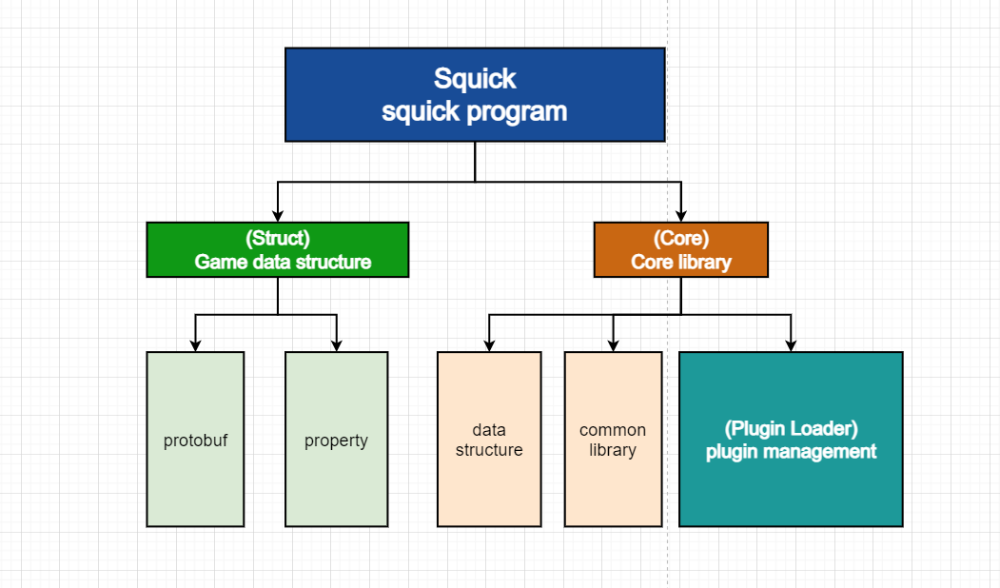
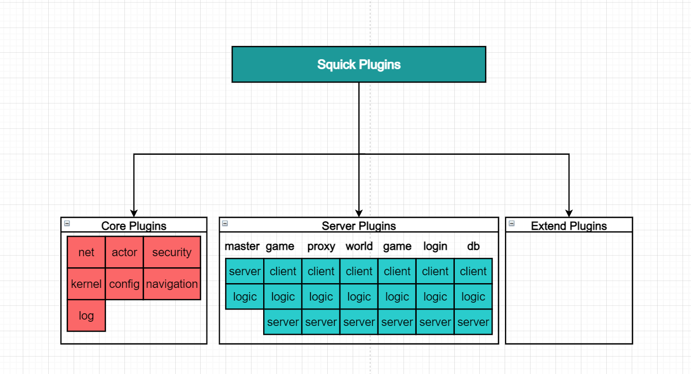
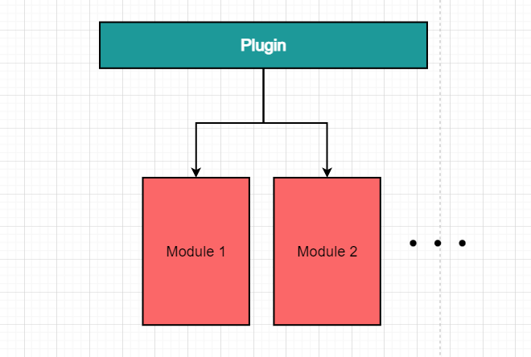

# Squick

Squick是游戏服务器快速相对较成熟开发方案，支持局部热重载、插件化开发、与客户端实现帧同步，可快速开发各种游戏项目等。

该框架遵循Apache2.0协议，可以随意商用。

目前已有三款商业游戏正在采用该框架研发当中，之后核心引擎会不断完善。

第一款: Unity研发的多人卡牌VR游戏，拥有每个玩家的面具、手同步，棋子，丧尸同步等，该游戏核心玩法已基本完成。

第二款：采用UE4研发的多人射击游戏，gameplay部分采用UE4来进行开发的，采用Squick来管理UE4的专用服务器以及游戏大厅逻辑。

第三款：采用Unity开发的休闲类游戏盒子，里面包含了很多小游戏，Squick负责玩家的数据存储以及部分对战功能。

客户端SDK: [SquickClient](https://github.com/pwnsky/SquickClient)

[快速开始](#快速开始)

**讨论QQ群：739065686**

**version:** 1.0.0

---


[](https://github.com/pwnsky/Squick)
[](https://github.com/pwnsky/Squick)
[](https://opensource.org/licenses/Apache-2.0)


## 特性

- 采用动态连链接库方式动态加载插件，开发拓展插件，让开发服务器变成开发插件
- 通过sqkctl工具来实现生成和管理不同的项目，解耦squick代码与真正的项目代码。
- 插件化管理方式，可对插件进行加载与卸载实现不用关掉程序，就可以实现热重载功能。
- 日志捕获系统，在linux环境下程序崩溃时，自动dump stack调用链。
- 分布式服务、各服务之间通过网络来进行沟通，可通过分布式+集群方式减轻服务器压力
- Lua热更新、热重载、lua脚本可管理c++插件以及lua插件。通过lua可以动态热更新c++层面的插件(.so文件)，实现lua热更以及c++ native层的热更新。
- 支持 Redis + Mysql作为数据库
- 平台编译：支持Windows编译与Linux编译
- 一个物理机上单个进程启动全部服务器，方便开发调试。
- 一个物理机上启动多个独立进程的服务器，轻量化部署。
- 不同物理机上启动单个或多个服务器，分布式部署。（支持Windows机器与Linux机器连接）
- Go的Gin框架来做后台系统。
- 支持 kubernetes 部署


# 安装

## Windows上开发和编译

推荐在Windows10以上环境，采用Virsual Studio 2019 以上 编辑器进行开发。


### 采用Virsual Stuio来进行开发

在开发之前，需要下载相应的工具包，如下：

#### 下载基本包并安装

**cmake**

下载 https://cmake.org/download/


### 1. 第三方库编译

这里提供两种方法，推荐第一种，直接采用编译好的lib

#### 1. 直接用编译好的lib

将 https://github.com/pwnsky/SquickThirdPartyBuild/tree/main/Windows/ 下的build拷贝到 {project_path}/third_party 目录下即可不用编译第三方源码


#### 2. 源码编译

需下载依赖包，并安装到Windows中

**Win64 OpenSSL v3.0.7**

[EXE](http://slproweb.com/download/Win64OpenSSL-3_0_7.exe) | [MSI](http://slproweb.com/download/Win64OpenSSL-3_0_7.msi)


**MinGW**

编译lua需要，能编译出dll，但由于vc与gcc某些函数不兼容，导致squick程序的lua插件不能链接到该dll，需暂时借助第三方编译好的lua.lib来完成链接。

https://github.com/niXman/mingw-builds-binaries/releases


### 2 sqkctl工具编译

首先第一次编译时，先编译sqkctl工具，进入到工具目录下({project_path}/tools)，点击build_sqkctl.bat即可编译。编译完毕后，点击 generate_config.bat 生成相应的配置文件和代码文件。采用管理员权限运行 register_env.bat 注册squick的环境变量。


### 3. 主工程编译

编译完或者处理第三方依赖库后，就可以直接对主工程源码进行编译了。

之后再点击 generate_vs_project.bat 生成 vs项目工程在 {project_path}/cache下，打开{project_path}/cache/Project.sln 进行全部编译。将squick_exe项目设置为启动项，并修改工作目录为 {project_path}/bin，也可以设定相应参数调试不同服务器，之后就可以采用VS来启动调试全部服务器了。

编译完成后文件目录大致如下

```
bin
├── event.dll
├── event_core.dll
├── event_extra.dll
├── squick_core.dll
...
├── libprotobufd.dll
├── plugin
│   ├── core
│   │   ├── actor.dll
...
│   └── server
│       ├── db
│       │   ├── client.dll
..
│       ├── game
...
├── squick.exe
..
```


### 在Windows平台上实现跨平台编译

#### 1. 安装wsl子系统

如果想在自己的Windows上实现跨平台编译Linux程序，也不想安装虚拟机来进行开发，推荐你安装WSL2，安装一个Ubuntu 20系统，之后采用linux子系统 选择[直接编译 ](#直接编译)了。

那么如果你想更改代码，又用不来vim，你在wsl里项目根目录下运行

```sh
bash open_explorer.sh
```

会打开文件浏览器，选择当前的上级目录，安装一个Vs code，直接采用Vs code来编辑代码吧。在Vscode中开启Terminal，在输入bash，即可切换到WSL，可以很方便的敲命令编译了。


#### 2. 采用clang++


## Linux上开发和编译

你可以直接任意选择你自己喜欢的开发方式，可以采用CMake生成 Qt工程，或直接采用Ridder打开CMake工程，以下提供了三种编译方式。

[直接编译](1. Linux直接编译)

[共享docker编译 ](2. Linux共享Docker编译 )

[一键docker编译](3. Linux一键Docker编译) 

默认编译的是debug版本，如果想编译为release版本，请打开{project_path}/build.sh，在第8行的Version改为release即可。在编译的时候，会在项目根目录下创建一个cache文件夹来存储编译时生产的临时中间文件。


### 1. Linux直接编译

采用物理机编译是为了开发以及测试更加方便。但可能需要你们自己手动配置各种搭建环境时出现的问题。

#### 编译squick

克隆代码

```
git clone https://github.com/pwnsky/Squick.git
cd Squick/tools
bash install_dev_env.sh
```

install_dev_env.sh脚本会自动下载编译工具，并且编译，如果出现不能编译，可能是缺少是依赖，linux依赖包如下：

```
git cmake unzip automake make g++ libtool libreadline6-dev libncurses5-dev pkg-config libssl-dev
nodejs npm libjsoncpp-dev uuid-dev zlib1g-dev
```

请采用手动进行安装以上工具包。

进入到cd {project_path}/tools

**编译第三方库**

```sh
bash build_third_party.sh
```

**编译sqkctl**

```
bash build_sqkctl.sh
```

**生成配置文件**

```
bash generate_config.sh
```

**编译squick** 

```
bash build_squick.sh
```


#### 安装Web后台前端代码依赖

```sh
cd {project_path}/src/www/admin
npm install
```

如果node js 版本> 17，在安装依赖时或编译时，记得加环境变量

```sh
export NODE_OPTIONS=--openssl-legacy-provider
```

#### 编译Web代码

编译后台管理vue前端代码、后台服务器代码、网站vue前端代码。

```sh
cd {project_path}/www
bash ./build.sh
```

#### 测试运行

```
cd {project_path}/deploy && ./single.sh # 运行
```

如果运行成功，访问 http://127.0.0.1:8080/admin ，如果能够看到登录界面，那么编译没问题，运行`./stop.sh` 脚本退出。


### 2. Linux共享Docker编译

**推荐**

#### 1. 创建容器

这种是方式编译，懒得自己搭建开发环境，也是为了方便开发，让编译文件与开发文件直接映射，采用的是ubuntu:20.04环境来进行编译的。

```sh
cd {project_path}
cd docker/dev/ && bash creat.sh
```

#### 2. 进入容器执行命令

```sh
cd /mnt && bash clean.sh
cd /mnt && chmod +x build.sh && chmod +x third_party/build.sh

# 编译squick 第三方库
cd /mnt/third_party && bash ./build.sh

# 编译squick代码
cd /mnt/ && bash ./build.sh

# 编译后台管理前端vue代码
git config --global url."https://".insteadOf git://
cd /mnt/www/admin && npm install
# 安装第三方库依赖
#cd /mnt/third_party/build/drogon && make install

# 编译web代码，包含后台管理前端代码、服务器代码、网站前端代码等。
cd /mnt/www && bash ./build.sh
```

#### 测试运行

```sh
cd /mnt/deploy && ./single_start.sh # 运行
```

如果运行成功，访问 http://127.0.0.1:8080/admin ，如果能够看到登录界面，那么编译没问题，运行`./stop.sh` 脚本退出。


### 3. Linux一键Docker编译

已测试：测试时间：2022-11-19 22:13

采用的是ubuntu:20.04环境来进行编译的。采用该方法，是为了验证编译环境或快速搭建开发环境。编译的工程文件是从github中新下载下来的，下载到容器里的/root目录。

docker安装方法，这里就不用说了，只需一步就可以搭建编译环境以及编译。一键编译。

```sh
cd docker/dev/build/ && docker build -t squick .
```

编译完成后

```sh
cd {project_path}
docker run -it --name=squick --net=host -v `pwd`:/mnt squick
```

进入容器后

```sh
cd ~/Squick/deploy
./single_start.sh # 运行
```

如果运行成功，访问 http://127.0.0.1:8080/admin ，如果能够看到登录界面，那么编译没问题，运行`./stop.sh` 脚本退出。


### 编译后

编译完成后，在`{project_path}/deploy/bin` 下会出现编译好的二进制文件。如下

```
deploy/bin/
├── squick_core.so
...
├── plugin
│   ├── core
│   │   ├── actor.so
...
│   └── server
...
└── squick
```

编译成功后，可执行文件是在 ./bin/squick


## 搭建数据库

搭建数据库，推荐采用docker来创建数据库实例。

### 搭建Redis

这里采用docker来进行搭建，如果没有安装docker，请通过你分支下的包管理命令进行安装。

拉取redis镜像并创建运行redis容器

```
docker pull redis
docker run --name squick-cache -p 22222:6379  -d redis --requirepass pwnsky_squick # pwnsky_squick 是密码
```


### 搭建Mysql

```
docker pull mariadb
docker run --name mysql-db -p 10086:3306 -e MYSQL_ROOT_PASSWORD=pwnsky_squick -d mariadb
```

导入基本sql

```
```


## 生成配置文件

采用Office软件打开{project_path}/resource/excel/squick/DB.xlsx，修改里面的IP为你搭建redis的ip，默认为127.0.0.1。修改完毕之后，需要重新生产配置文件，需执行一个脚本进行生成。linux执行如下：

```
cd {project_path}/tools
bash generate_config.sh
```

windows执行

```
cd {project_path}/tools
generate_config.bat
```


## 打包

打包可分为Windows打包和Linux打包

### Windows

点击generate_deploy.bat


### Linux

```
bash generate_deploy.sh
```

运行后，所有打包的文件会保存在 {project_path}/deploy 下。


## 启动

在 {project_path}/deploy目录下，单个进程启动所有服务器命令如下：

linux执行

```bash
bash ./single_start.sh
```

window执行

```
single_start.bat
```

看到了启动各个服务器的界面，说明你已经完成编译以及启动了。

除此之外，还支持命令启动独立的服务器，比如：

```
squick plugin=master.xml server=master id=3
```


## 项目工程目录与文件介绍

该工程项目结构如下：

```
deploy:   // 服务端生成可部署文件
config:   // 服务端配置
data:     // 服务程序储存数据
bin:      // 服务端程序
tools:    // 工具
src:          // 主要源码文件夹
	lua:      // lua脚本代码
    server:   // 各服务器代码
    squick:   // 核心代码
    tester:   // 测试代码
    tools:    // 工具代码
    tutorial: // 教学示例代码
    test:     // 测试代码
    proto:   // protobuf代码
    www:          // 网站系统代码
    	admin:    // 后台前端代码
    	server:   // web服务端代码
    	website:  // 官网前端代码
third_party:  // 第三方代码
cache:        // 编译时的临时文件
others:       // 其他
```

deploy: 服务端生成可独立运行的文件集，其中包含了可执行的文件、脚本、配置文件等等，用于直接上传到服务器上运行，好比Unity或UE4打包出来的文件一样。

config: 配置文件，里面包含了日志配置文件、插件配置文件、Excel生成的配置表等等。如下：

```
struct: sqkctl将{project_path}/resource/excel 下的所有xlsx文件转化成的xml文件，主要记录配置表中字段的属性，其中包含了，名称、描述等这些信息。
ini: sqkctl将{project_path}/resource/excel 下的所有xlsx文件转化成的xml文件，主要记录配置表中目前有哪些内容。
plugin: 各种服务器的插件配置文件
log: 服务器的日志配置文件
```

更新中...

src/lua:

```
```

src/server:

```
```


src/tools:

```
```


## 创建新项目

在空白目录下，输入

```
sqkctl init
```

会在当前目录下初始化工程，如下：

```
.gitignore
squick
files
base.json
chnaged.json
README.md
```

之后就可以基于squick目录下的工程来改动为自己的工程了。


## kubernetes部署

需要环境docker + kubernetes，采用Linux Docker进行编译，打包为发布版本，再采用K8s进行分布式运行。

```
```


## sqkctl

sqkctl是squick的项目管理工具，为了方便让Squick核心代码与项目工程代码实现解耦管理，提供了部分命令在工程中使用，例如squick工程的初始化，squick核心代码更新，squick核心代码打patch，对比等等，类似于git的操作对版本进行管控，但我们的目的不是为了版本的管控，而是让项目代码与squick代码进行在管理层面进行解耦。除此之外也提供了其他命令，比如excel命令，会根据excel文件生成squick所需要的配置文件。


项目工程主要包含了如下:

```
project：
.gitignore : 忽略squick文件夹
files: 在该目录下已更改的文件：通过squick_ctl add 命令提交squick目录下已更改的文件或增加的文件
squick: 项目的全部文件，包含了suqikc和我们自己项目的文件
base.json : 记录了squick最初代码的所有文件hash
chnaged.json : 已更改的所有文件hash
```

在我们的git远程项目工程中也只有：

```
.gitignore
files
base.json
chnaged.json
```

这些文件或文件夹，没有squick的代码，这样对于后期升级squick核心代码的时候就比较方便了，diff下存储的就是我们改动的代码，只要我们动的核心文件不是升级中改动的文件，squick核心代码就可以升级了，采用squick update命令即可实现，该命令也会校验文件是否冲突，如果出现文件冲突，那么说明升级的文件和我们改动的文件是同一个文件，可能强制升级之后会出现报错。


提供的命令如下: 

sqkctl命令:

excel: 将excel文件转化称配置文件。

init: 初始化工程，通过squick_path环境变量拷贝squick代码到当前工程，并计算squick代码的所有文件hash，并生成base.json

patch: 将diff下的代码patch到squick代码中。

add: 将获取改动的文件保存到diff文件夹下。

diff: 显示所改动的文件

version: 获取squick代码的版本号

update: 更新除了改动文件的squick所有文件 (谨慎使用)

pull: 拉去当前squick版本下的代码


# 服务架构

## 对象连接关系

| 对象             | master | login | game | world | db   | proxy | gateway | gameplay manager | gameplay | client |
| ---------------- | ------ | ----- | ---- | ----- | ---- | ----- | ------- | ---------------- | -------- | ------ |
| master           | x      | ✓     | ✓    | ✓     | ✓    | ✓     | ✓       | x                | x        | x      |
| login            | ✓      | x     | x    | x     | ✓    | ✓     | x       | x                | x        | x      |
| game             | ✓      | x     | x    | ✓     | ✓    | ✓     | x       | x                | ✓        | x      |
| world            | ✓      | ✓     | ✓    | x     | ✓    | ✓     | x       | x                | x        | x      |
| db               | ✓      | ✓     | ✓    | ✓     | x    | x     | x       | x                | x        | x      |
| proxy            | ✓      | ✓     | ✓    | ✓     | x    | x     | x       | ✓                | x        | ✓      |
| gateway          | ✓      | x     | x    | x     | x    | x     | x       | ✓                | x        | x      |
| gameplay manager | ✓      | x     | ✓    | ✓     | x    | x     | x       | x                | ✓        | x      |
| gameplay         | x      | x     | x    | x     | x    | x     | x       | ✓                | x        | ✓      |
| cleint           | x      | x     | x    | x     | x    | ✓     | ✓       | x                | ✓        | x      |

### 服务器说明

客户端连接的是代理服务器，由代理服务器连接各个其他服务器，统一由Master服务器来进行管理。除了Master服务器单开之外，其他服务器都可以进行分布式多开来负载均衡。所有服务端程序都可以跨物理机进行部署。

#### 代理服务器

##### 介绍

代理服务器( Proxy Server )，玩家客户端与内部服务器的中间桥梁。

##### 部署类型

可以跨物理机多服务器部署，(不分区服)。

##### 连接关系

代理服务器在启动时，会与登录服务器、世界服务器、游戏服务器，中央服务器进行长连接，启动后，是玩家连接的对象。

##### 协议类型

与玩家：tcp、http、udp、kcp协议

与内部服务器：tcp

#### 网关服务器

##### 介绍

网关服务器( Gateway Server )，用于分配代理服务器给客户端的服务器，提供负载均衡算法，提供最优的代理服务器用于给客户端连接。

##### 部署类型

可以跨物理机多服务器部署，(不分区服)。

##### 连接关系

与客户端、中央服务器进行连接。

##### 协议类型

与玩家：http协议

与内部服务器：tcp


#### 登录服务器

##### 介绍

登录服务器( Login Server )，在玩家登录授权之后，玩家通过代理服务器，可以有权访问游戏服务器。

##### 部署类型

不同区服可以跨物理机多服务器部署。

##### 连接关系

与代理服务器、数据库服务器、中央服务器进行连接。

##### 协议类型

tcp

#### 世界服务器

##### 介绍

世界服务器( World Server )，主要管理 Proxy、Gateway、Login、Game、Db等服务器之间的服务表同步。相当于一个游戏的区服，同步整个区服涉及分布式连接的所有服务器。并定时同步涉及连接的服务器表给所有连接world服务器的服务器。

##### 部署类型

不同区服可以多服务器部署。

##### 连接关系

与代理服务器、数据库服务器、游戏服务器、中央服务器进行连接，网关服务器，登录服务器连接，PVP管理服务器 进行连接。


##### 协议类型

tcp

#### 游戏服务器

##### 介绍

游戏服务器( Game Server )，与玩家交互的主要服务器，比如好友添加、系统邮件、聊天、场景切换、刷本、抽奖、领取物品这些常规操作。


##### 部署类型

可以多服务器部署。

##### 连接关系

会与代理服务器、数据库服务器、世界服务器、中央服务器进行连接。

##### 协议类型

tcp


#### 数据库 Proxy 服务器

##### 介绍

数据库服务器( DbProxy Server )，是Redis与Mysql数据库的代理服务器，通过Db Server，临时存储数据在内存里，每 1 ms 检测刷新已更变的数据内容到Redis里进行缓存，10S后再通过Redis刷数据到mysql数据库里进行存储。在玩家下线后，内存数据保存5分钟，超时后会内存中的玩家数据。


##### 部署类型

不同区服可以多服务器部署。

##### 连接关系

会与登录服务器、游戏服务器、世界服务器、中央服务器、Mysql数据库、Redis数据库进行连接。

##### 协议类型

tcp


#### 中央服务器

##### 介绍

中央服务器( Master Server )，用于管理分布式架构下的服务器，在被监控的服务程序出现Crash的时候，可由Master Server通过SSH操控启动Crash的服务器重新进行服务启动。也提供各服务器管理与调试接口。

##### 部署类型

只能单独部署一个。

##### 连接关系

会与代理服务器、登录服务器、游戏服务器、世界服务器、数据库服务器进行连接。

##### 协议类型

tcp


### **Gameplay管理服务器**

##### 介绍

Gameplay管理服务器( Gameplay Manager Server )，用于管理PVP服务器，可负责创建Gameplay服务器实例、销毁、监控，也充当Gameplay服务器与Game服务器之间的代理。在Gameplay服务器连接Gameplay管理服务器后，根据key、account、server_id来与Game Server进行连接。

##### 部署类型

可以多部署。

##### 连接关系

与世界服务器和游戏服务器连接。

##### 协议类型

tcp

### **Gameplay服务器**

##### 介绍

Gameplay服务器，是由UE4或Unity3d进行开发，Gameplay管理服务器进行管理，在每一场对局中启动一个Gameplay服务器用于计算该场游戏对局。

##### 部署类型

可以多部署，具有临时性，游戏结束即会销毁该实例，后期将优化服务器，将改成排队系统，不停服即可切换另一局对战，降低创建于销毁实例的开销。

##### 连接关系

与Gameplay管理服务器和玩家连接。

##### 协议类型

unreal | unet | tcp


## 服务启动顺序

### Master服务器

启动后，等待World服务器、登录服务器进行连接，

### Db服务器

自动给连接redis数据库

### World服务器

自动连接DB服务器，并等待 Game服务器、Gameplay Manager服务器、Proxy服务器、Gateway服务器连接。

### Login服务器

自动连接DB服务器与世界服务器。

### Game服务器

Game服务器自动连接World服务器，并等待Proxy服务器、Gameplay Manager服务器注册（这个有世界服务器来完成）

### Gameplay Manager服务器

自动连接world服务器，并注册该服务器在game服务器上

### Proxy服务器

自动连接world服务器，并注册该服务器在game服务器上

### Gateway服务器

自动连接world服务器

### Gameplay服务器

有玩家在创建对局中时， 由Gameplay  Manager进行创建和启动，启动成功后会连接Gameplay  Manager服务器。对局结束后自动销毁。


## 进入游戏服流程

**1. client <-> gateway ** 

向网关服务器获取代理服务器，网关服务器会根据代理服务器的连接情况选择工作量最小的代理服务器给客户端

**2 client <-> proxy <-> login** 

玩家先进行登录验证，登录成功，会将玩家的验证token保存在代理服务器上，在代理服务器上也对该连接进行授权。

若玩家出现离线重连，可以无需登录，直接对客户端的token进行验证，验证成功，对该连接socket进行授权。

**3 client <-> proxy**

客户端连接代理服务器，获取到世界服务器列表。

玩家选择区服，也相当于选择一个世界服务器，发送给代理。

代理会根据世界服务器的服务器表根据负载均衡派发出一个工作量最小的游戏服务器给客户端。

**4 client <-> proxy <-> game**

在此之后，客户端可有权访问游戏服务器。Squick内核事件通知是需要基于对象之上才能够进行的，所以玩家初次进行服务器需要创建一个服务器上的对象，好比类似于创建一个游戏角色。

**5 client <-> proxy <-> game <-> db**

在创建过程会根据玩家配置表生成内存对象，存储在redis中，创建成功依次响应客户端，游戏服务器上的玩家数据会每隔3分钟将数据同步给数据库服务器。

**5 client <-> proxy <-> game**

服务的上创建玩家数据后，返回对象id，之后就是基于该对象id上进行发包收包了，即是正式进入游戏。

若玩家离线，服务端会销毁该对象，游戏服务器也会将玩家数据同步给数据库服务器。


## 玩家Gamplay开局流程

基于玩家登陆成功之后

**1 client <-> proxy <-> game**

创建房间的逻辑在game服务器上，在玩家创建房间，可以等待其他玩家的加入，房主在设定游戏对局参数时，数据会保存所设定参数值在房间对象中。

**2 client <-> proxy <-> game <-> gameplay manager**

玩家点击开始时，由game服务器生成 gameplay服务器的instance id、key、game_id将其发送给gameplay manager服务器，gameplay manager收到后，通过设置启动参数来启动gameplay服务器。

**3 gameplay <-> gameplay manager <-> game**

此时 gameplay manager服务器充当 gameplay服务器与 game服务器之间的代理服务器。

gameplay 启动后，连接gameplay manager服务器，在gameplay manager服务器上请求与game服务器进行连接，验证成功后gameplay manager充当代理。

gameplay 服务器向game服务器获取房主设定的参数，并获取该房间所有玩家属性的信息，根据房主设定的参数，初始化数据，并加载相应的地图，加载完毕后，反馈gameplay 服务的基本信息给game服务器。

**4 client <-> proxy  <-> game**

gameplay服务器初始化完毕后，由game服务器反馈gameplay的ip端口给客户端。

**5 client <->  gameplay**

在gameplay对局中，玩家直接与gameplay服务器进行连接对局，再次过程中，玩家也保持与game服务器进行连接，如果gameplay对局中，中途有奖励礼物情况gameplay服务器通知玩家与game服务器。

**5 gameplay <->  game**

gameplay对局结束或者玩家全部离线退出房间时，由gameplay_manager通知gameplay服务器自行销毁。


# 后台管理系统

后台服务端基于Go语言的Gin框架来做，前端采用vue2的antd。


## 热更新基本原理

#### Lua脚本热更新

为服务器增加http接口，通过调用该接口，服务器会通过lua模块重新加载lua脚本，从而达到动态更新服务端逻辑。只能对登录服务器、游戏服务器、世界服务器进行热重载。

#### c++插件 热更新

目前还暂未实现，当然也没有必要。

在更新新插件时，通过中央服务器对每一个子被更新的服务器进行进程环境保护，缓存代理服务器上客户端的请求包，等待被更新的服务端计算完毕之后，对其响应包进行缓存，在被监控的服务器处于安全空闲状态的时候，将其被更新的插件的所有模块安全卸载掉，重新加载新的插件进来，通知中央服务器然后继续运行，中央服务器再通知所有代理服务器，继续转发请求包。


## 插件状态调用顺序

``` 
SquickPluginLoad -> 插件构造函数 -> Install -> Uninstall -> 插件析构函数-> SquickPluginUnload
```

## c++模块状态调用顺序

```
模块构造函数 -> Awake -> Start -> AfterStart -> ReadyUpdate -> Update -> BeforeDestory -> Destory -> Finalize -> 模块析构函数
```

### Lua模块调用状态顺序

```
awake -> init -> after_init -> before_destry -> destry
```


## 基本概念

### Module

表示一类逻辑业务的合集, 相对来说功能比较集中, 可以做到低耦合, 并且可以通过`IOP`(面向接口编程)的方式来给其他模块提供耦合功能.例如LogModule等。

### Plugin

表示一系列Module的集合, 按照更大的业务来分类, 例如GameLogic插件, Navimesh插件等。

### Application

表示一个独立的完整功能的进程, 可以包含大量插件, 例如squick.exe启动时，加载各个插件来执行。

### Property

表示一维数据, 通常用来表示Object附带的任意一维数据结构, 当前可以为常用内置数据类型(`bool` `int` `float` `string` `GUID`). 例如`玩家对象`附带的血量，名称等数据。

### Record

表示二维数据, 通常用来表示Object附带的任意二维数据结构,结构与Excel的二维结构类似, 包含`Row`和`Column`, 并且结构可以通过Excel动态传入, 记录值可以为常用内置数据类型(`bool` `int` `float` `string` `GUID`). 例如`玩家对象的`附带的`背包物体`。

### Object

表示游戏内动态创建的任意对象, 该对象可携带有`Property`和`Record`。

### GUID

用于区别玩家连接或游戏对象的唯一ID。

### Event

游戏逻辑监听和产生事件, 用来解耦游戏逻辑。


## Squick核心架构

程序结构



采用加载不同插件方式来实现不同服务功能，都可适合小、中、大型团队人员进行同时开发，各自只需将自己的功能封装到自己的插件里，通过模块接口实现跨插件调用，提高开发效率。


## 代码命名规范

遵循google c++开发规范。

ref: https://blog.csdn.net/qq_41854911/article/details/125115692


## 插件系统

Squick当前所有重要插件如下：





插件与模块的关系



每一个插件为一个动态链接库文件（.so文件），将功能代码封装为插件的模块，可通过插件来加载各个插件的功能模块。

每个插件可以包含一个或多个模块


# 版本

1.0.0 : 

date: 2023.03.10

Intro: 文档完善、代码解耦

