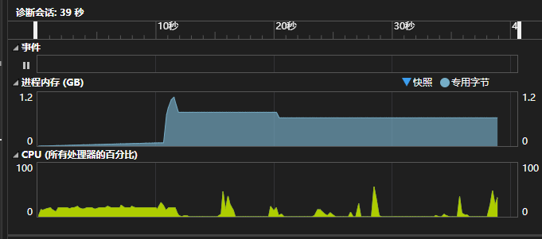
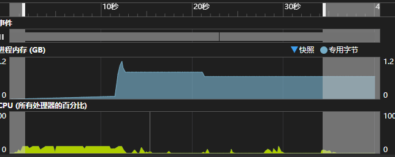
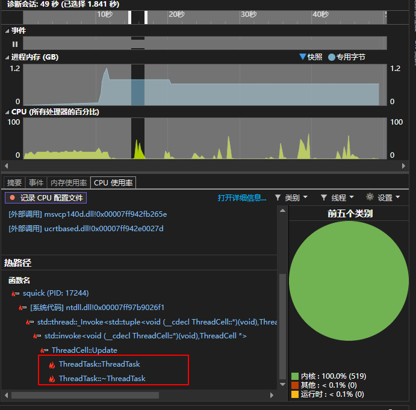
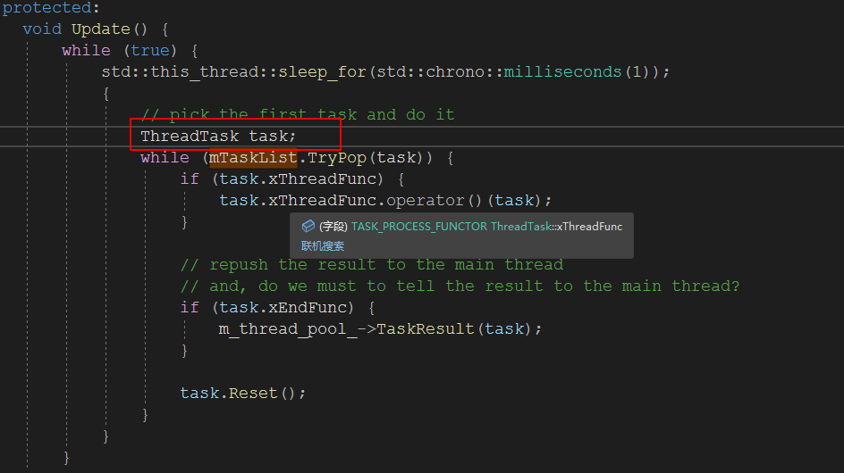
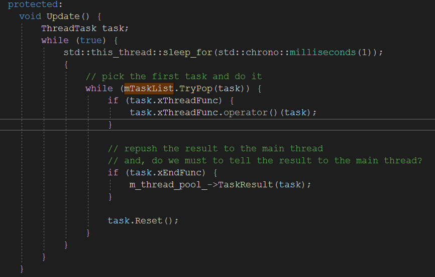
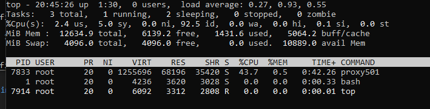
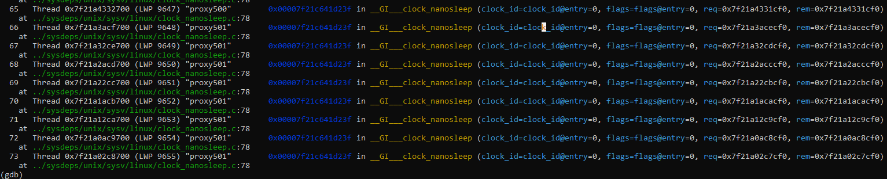
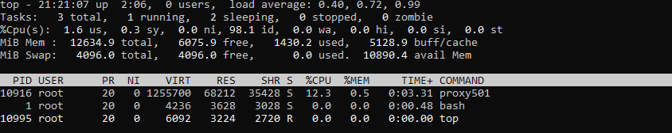
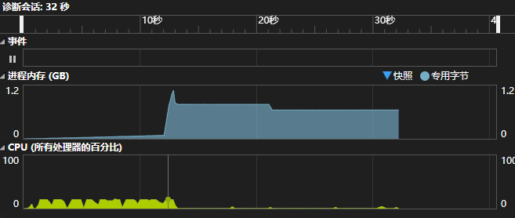

# 优化


## CPU 占用优化

CPU在Linux平台占用比较高，在Windows上通过VS进行调试检测，发现CPU有异常突起，如下：



通过最终优化调整如下：



具体追踪，对CPU占用情况进行捕获，发现如下



定位到是 ThreadTask 类的构造函数和析构函数调用次数特别频繁。



以上定位到该代码，发现，不管是否获取到线程任务，都会触发该对象的构造和析构函数，所以解决方案我们将其临时变量移动到循环外，避免多次频繁调用构造和析构函数。



通过以上方式优化了该CPU不少，但即便如此，在Linux平台下，CPU占用还是比较高，如下：




任务线程池占用比较高，每个节点都会创建出8个线程池，如果所有节点运行在一个进程，就会创建70多个线程，且每一个线程每随眠只睡眠一毫秒，再抢占任务执行，大部分时间都是没有任务的，这就是导致严重占用CPU的原因，gdb调试如下：



在这里我的优化点是将线程池的每一帧循环时间进行延长到0.1秒，因为工作任务一般相对都比较少，且每个节点有8个线程进行处理，可以完全应付相应的工作内容。一下是优化后在Linux下CPU的占用情况。





在Windows平台下监测情况如下：




对于主线程还有线程池每一帧的循环时间，在 src/squick/core/base.h 下有相关定义，可根据服务器压力情况进行修改。

```c++
// 线程池 每一帧睡眠时间，单位毫秒
#define THREAD_POOL_SLEEP_TIME 100
// 主线程 每一帧睡眠时间，单位毫秒
#define MAIN_THREAD_SLEEP_TIME 1
```


